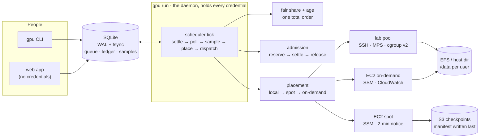

# gpu-broker

One queue in front of the club's GPU capacity - paid cloud, a lab machine, and
free tier - with a dollar budget nobody can silently exceed.

[](https://github.com/lgoyal6/gpu-broker/actions/workflows/ci.yml)


## Why this exists

I run the AWS Student Builder Club at UCSD. We share one credit pool. What
actually happens is that somebody launches a `g5.xlarge`, walks away, and the
credits are gone by Thursday. Nobody knows who holds what, and nothing enforces
a budget. Separately, there is a lab machine with an idle RTX A6000 nobody can
reach.

So: one queue, three kinds of capacity, and a broker that answers *who holds
what*, *what is it costing*, and *how long do the credits last* - and refuses to
overspend rather than telling you afterwards.

## Quickstart

No AWS account, no GPU, under a minute:

```bash
pip install -e '.[web]'
gpu doctor
gpu submit --gpu a10g --hours 0.01 -- python train.py
gpu run
gpu status
```

Everything runs against a simulator until you point it at real hardware.
`gpu doctor` tells you what is missing before anything else does.

For your club, see **[docs/DEPLOY.md](docs/DEPLOY.md)**.


## Architecture



Two processes on purpose. `gpu web` has to be reachable for GitHub's OAuth
callback and therefore builds **no backends at all** - it cannot launch or
terminate anything. `gpu run` holds the AWS keys and the SSH key and does all
the work. A cancel from a browser is a *request* the daemon acts on.

## The three rules everything else follows from

**Fair share, with an escape hatch.** Somebody who has used less of the pool
this month goes ahead of a heavy user, regardless of who submitted first. Prior
usage decays by half every 14 days. A waiting-time term is weighted at least as
heavily as the fairness term, so a heavy user is never starved - the config
refuses to start otherwise.

```
priority = 0.5 × (1 − share of pool used) + 0.5 × min(1, waited / 12h)
```

**Two currencies, never converted.** Cloud costs dollars; the lab A6000 costs
GPU-hours. There is no exchange rate, so every ledger row carries a currency and
you get two budgets. Shadow-pricing free hours into fake dollars would report
"you spent $3.20" to somebody who ran on free hardware.

**Budgets are reserved, not checked.** A job's ceiling is held at admission,
settled as it runs, and the remainder released however it ends. Your own budget
*refuses* you with the shortfall named; the pool cap makes you *wait*.

Deeper: **[docs/DESIGN.md](docs/DESIGN.md)**.

## Commands

| | |
|---|---|
| `gpu submit --gpu a10g --hours 4 --budget 12 -- python train.py` | queue a job |
| `gpu queue --why` | what is waiting, and the arithmetic behind the order |
| `gpu status [id]` · `gpu logs <id> -f` | one job, its samples, its output |
| `gpu who` · `gpu budget [--pool]` | who holds what · where the month went |
| `gpu forecast` · `gpu prices` | days of runway · what capacity costs |
| `gpu reclaim` | jobs holding a GPU without using it |
| `gpu reap` · `gpu reconcile` | machines with no live job · records vs reality |
| `gpu hosts` · `gpu env list` | lab machines · named environments |
| `gpu report` · `gpu digest` | what actually happened · the weekly note |
| `gpu doctor` | what is wrong, and what to do about it |
| `gpu run` · `gpu web` | the daemon · the pages |

Day-to-day operations: **[docs/OPERATIONS.md](docs/OPERATIONS.md)**.

## What the gates prove

Each phase has an acceptance test that runs in CI with no AWS credentials.

| | |
|---|---|
| **Fair share** | 20 jobs, 5 users, unequal prior usage, submitted heaviest-first - the queue comes out ordered by usage, not arrival. Run to completion, spend lands within $0.20 across users. |
| **Durability** | A real `SIGKILL` of a real process mid-write. Queue, ledger, and the job→machine mapping all survive; the broker restarts and drains. |
| **Budgets** | Over-budget is refused with the shortfall as a number *and* in the text. The pool cap is never crossed across 60 ticks. |
| **MPS sharing** | Two users on one A6000, each with its own memory limit; one filling its limit does not touch the other; killing one leaves the other running with its memory intact. |
| **Spot resume** | 100 jobs, interruptions injected at random. All complete, none twice, and **all with the correct final answer** - the simulated job accumulates a checksum that is only right if every step ran exactly once across every attempt. |
| **Work lost** | Computed from the record and proven zero, with a companion test that deliberately loses work and checks the report *says so*. |

## Testing

```bash
pytest -m "not aws"    # the fast loop, ~80s
pytest                 # everything, ~4min
ruff check --select F,E9 gpu_broker tests
```

640 tests. Nothing needs the network, an AWS account, or a GPU.

The doubles are chosen so tests fail for real reasons: **moto** answers the
actual AWS APIs (and honours `DryRun`), **asyncssh** runs a real SSH server with
a simulated GPU host behind it that parses the exact command strings the broker
sends, and the checkpoint adapters are tested against **real torch** - a run
stopped at step 4 and resumed must produce bit-identical weights.

## Repository layout

```
gpu_broker/
  scheduler.py      one tick: settle → poll → sample → place → dispatch
  admission.py      refused vs waits, and why they differ
  fairshare.py      the priority function
  placement.py      tier policy, with the reasoning recorded per job
  store.py          the only module that writes SQL
  checkpoint.py     manifest-last uploads, S3 and local
  adapters/         what a training script imports (torch, HF, plain)
  backends/         fake · ec2 (spot + on-demand) · local
  local/            SSH transport, the exact shell commands, host health
  web/              FastAPI, Jinja, ~30 lines of JS. No build step.
  report.py         the measurement report, including where it loses
docs/               design, deploy, operations
tests/              640 tests across 30 files
```

## Limitations (deliberate)

- **Nothing here has run on real hardware.** No real EC2 instance, no real
  A6000, no real spot interruption, no real `docker build`. The doubles are
  good; the first deploy will still find things.
- **It cannot snapshot a process.** Checkpointing is a contract your training
  script participates in - a signal and a directory - not something done to it.
  A job that ignores the signal restarts from the beginning.
- **MPS overhead is unmeasured.** Two jobs sharing one A6000 is slower than one
  having it, and by how much needs the same job timed both ways on the card.
  The report names this as not measured rather than leaving a gap.
- **`gpu reap` and `gpu reclaim` report; they do not act.** Reclaim is off until
  you turn it on. Reap has no `--force`, and a test enforces that.
- **No storage quota.** `/data` is shared space; usage is reported, not capped.
- **The forecast is a straight line.** Three people starting week-long runs
  tomorrow is not in that number.

More, with the reasoning: **[NOTES.md](NOTES.md)**.

## License

MIT. See [LICENSE](LICENSE).
