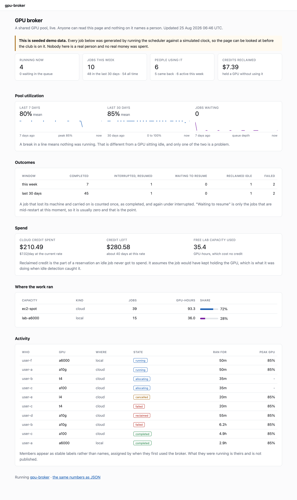
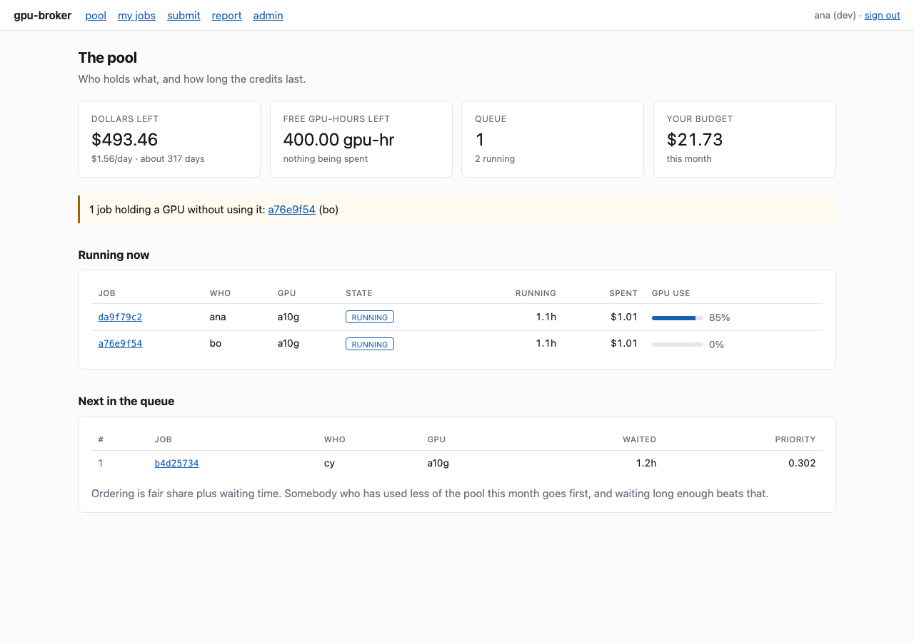
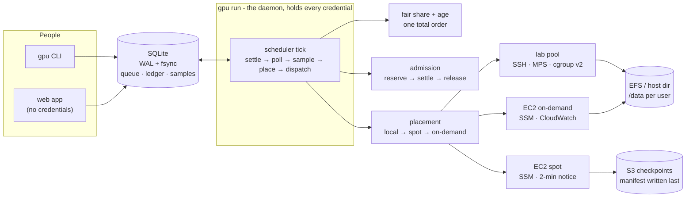

# gpu-broker

One queue in front of the club's GPU capacity - paid cloud, a lab machine, and
free tier - with a dollar budget nobody can silently exceed.

[](https://github.com/lgoyal6/gpu-broker/actions/workflows/ci.yml)

**[Live status page](https://gpu-broker-status.vercel.app)** - pool utilization,
jobs run, credits reclaimed and queue depth, with no sign-in and no usernames.

[](docs/status-page.png)

*That page and the screenshot above are currently a snapshot of seeded demo
data, and say so on the page. Both are replaced by real numbers as soon as the
pilot runs - see [Demo data and the pilot](#demo-data-and-the-pilot).*


## Why this exists

I run the AWS Student Builder Club at UCSD. We share one credit pool. What
actually happens is that somebody launches a `g5.xlarge`, walks away, and the
credits are gone by Thursday. Nobody knows who holds what, and nothing enforces
a budget. Separately, there is a lab machine with an idle RTX A6000 nobody can
reach.

So: one queue, three kinds of capacity, and a broker that answers *who holds
what*, *what is it costing*, and *how long do the credits last* - and refuses to
overspend rather than telling you afterwards.

## Quickstart

No AWS account, no GPU, under a minute on a warm pip cache:

```bash
python3 -m venv .venv && source .venv/bin/activate
pip install -e '.[web]'
gpu doctor
gpu submit --gpu a10g --hours 0.01 -- python train.py
gpu run
gpu status
```

The venv line is not boilerplate. A current Homebrew or Debian Python refuses
`pip install` outside one with `error: externally-managed-environment`, and on a
Homebrew Python there is no `pip` on `PATH` at all, only `pip3` - so without it
the very first command fails, and it fails differently depending on which
Python you have. Python 3.11 or newer; 3.14 resolves cleanly.

`python train.py` does not have to exist. Until you point the broker at real
hardware every job runs against the simulator, which is the whole point of the
first minute: you get a queue, a ledger and a completed job before you have
decided whether any of this is worth wiring to an account. `gpu doctor` tells
you what is missing before anything else does.

`gpu run` is not a daemon you have to interrupt here - it schedules until the
queue drains and then exits, so the five lines above end on their own.

For your club, see **[docs/DEPLOY.md](docs/DEPLOY.md)**.



## The status page

The club app is behind GitHub OAuth, which is right for something that spends
money and useless for showing anybody that the thing works. So there is exactly
one unauthenticated page.

```bash
gpu web --public              # club app, plus /status with no sign-in
gpu web --only-public         # just the status page, nothing else mounted
```

It publishes pool utilization over 7 and 30 days, jobs run this week and this
month split by outcome, credit spent and reclaimed, runway at the current burn
rate, queue depth, what is running now, and the split between cloud and local
capacity. The same numbers are served as JSON for anything that would rather not
scrape HTML: `/status.json` under `--only-public`, `/status/status.json` when it
is mounted into the club app.

What it does not publish: usernames, commands, job ids, hostnames, instance ids,
log lines. Members appear as `user-a`, `user-b`, assigned by when they first
used the broker - an ordinal rather than a hash, because a hash of a GitHub
login is reversible when the roster is twenty names.

Two things are structural rather than careful:

- **Read-only by construction.** The page is served by a separate ASGI app whose
  route table has no submit, no cancel, and no admin. A test walks the routes
  and fails if any of them accepts anything but `GET`. `--only-public` runs that
  app alone, so the public hostname is not even the same process as the one that
  can sign people in.
- **The aggregates are built by addition, not subtraction.** A `PublicJob` is
  constructed field by field from a `Job` rather than being a `Job` with fields
  hidden in the template, so adding a column to the jobs table cannot leak it.

The page is cached for a few seconds, because a link that gets attention arrives
as a burst and rebuilding the aggregates per reader turns one link into a
hundred table scans against the file the scheduler is writing to.

For somewhere that cannot run the broker, `python docs/_status_export.py` writes
the same page as one self-contained HTML file plus its JSON. That is a snapshot
rather than a live page: it shows the pool as it was when the export ran. The
genuinely live page is the `--only-public` process next to the scheduler.

## Demo data and the pilot

A status page with nothing on it convinces nobody, and inventing numbers is
worse than an empty page. So there are two honest ways to have something to
look at.

**Seeded demo data** lives in its own database, never in the same tables as real
jobs:

```bash
gpu demo seed                 # builds <state dir>/demo
gpu web --only-public --state-dir ~/.gpu-broker/demo
```

Every row is produced by running the real broker - real submissions, real ticks,
real utilization samples, a real spot interruption that resumes from its
checkpoint, and a real idle reclaim with the samples that justified it. Because
it drives the real paths it doubles as an integration fixture: the scenario
reports which lifecycle states it actually reached, and a test asserts the list.
Any page built from it is labelled seeded demo data, and that label cannot be
turned off.

**Pilot mode** puts real work on the lab GPU through the broker before twenty
people are on it:

```bash
gpu submit --pilot --hours 6 -- python train.py
```

Pilot jobs run on free local capacity only. They are pinned to the local tier,
so placement cannot fall back to spot when the lab machine is busy, and nothing
in the cloud is provisioned. They are recorded exactly like a club job, tagged
`pilot` rather than `seeded`, and they count in every number on the status page.
While the pool has one user the page says so, because a queue of one is not
evidence of a queue.

## Architecture



Two processes on purpose. `gpu web` has to be reachable for GitHub's OAuth
callback and therefore builds **no backends at all** - it cannot launch or
terminate anything. `gpu run` holds the AWS keys and the SSH key and does all
the work. A cancel from a browser is a *request* the daemon acts on.

## The three rules everything else follows from

**Fair share, with an escape hatch.** Somebody who has used less of the pool
this month goes ahead of a heavy user, regardless of who submitted first. Prior
usage decays by half every 14 days. A waiting-time term is weighted at least as
heavily as the fairness term, so a heavy user is never starved - the config
refuses to start otherwise.

```
priority = 0.5 × (1 − share of pool used) + 0.5 × min(1, waited / 12h)
```

**Two currencies, never converted.** Cloud costs dollars; the lab A6000 costs
GPU-hours. There is no exchange rate, so every ledger row carries a currency and
you get two budgets. Shadow-pricing free hours into fake dollars would report
"you spent $3.20" to somebody who ran on free hardware.

**Budgets are reserved, not checked.** A job's ceiling is held at admission,
settled as it runs, and the remainder released however it ends. Your own budget
*refuses* you with the shortfall named; the pool cap makes you *wait*.


**One member cannot take the pool, and membership is rechecked before a job
runs.** A reservation was already backpressure, but a reservation is whatever
`--budget` says: on the default $25 a member reaches 33 queued jobs, and at
`--budget 0.01` the same member reaches 2,500 - all of them re-scored on every
tick, which is everybody's tick. So there are explicit bounds on command size,
queued jobs per member, machines held per member, and log volume per job.
Hitting a queue limit is a *refusal* with the number named; hitting the
concurrency limit is a *wait*, and the job keeps its place.

Separately, an officer can take somebody off the pool with
`gpu admin suspend <user> --reason "..."`. That lives in the users table rather
than in the web app, because `gpu run` is what spends the money and it never
imports the web app. A suspended member's queued jobs are *held*, not cancelled:
`gpu admin restore` puts them back where they were.

Deeper: **[docs/DESIGN.md](docs/DESIGN.md)**.

## Commands

| | |
|---|---|
| `gpu submit --gpu a10g --hours 4 --budget 12 -- python train.py` | queue a job |
| `gpu queue --why` | what is waiting, and the arithmetic behind the order |
| `gpu status [id]` · `gpu logs <id> -f` | one job, its samples, its output |
| `gpu who` · `gpu budget [--pool]` | who holds what · where the month went |
| `gpu forecast` · `gpu prices` | days of runway · what capacity costs |
| `gpu reclaim` | jobs holding a GPU without using it |
| `gpu reap` · `gpu reconcile` | machines with no live job · records vs reality |
| `gpu hosts` · `gpu env list` | lab machines · named environments |
| `gpu report` · `gpu digest` | what actually happened · the weekly note |
| `gpu doctor` | what is wrong, and what to do about it |
| `gpu admin suspend <user>` · `gpu admin restore <user>` | take somebody off the pool · put them back |
| `gpu submit --pilot -- python train.py` | real work, lab GPU only, nothing in the cloud |
| `gpu demo seed` | a demo database, in its own file, labelled as one |
| `gpu run` · `gpu web [--public\|--only-public]` | the daemon · the pages · the status page |

Day-to-day operations: **[docs/OPERATIONS.md](docs/OPERATIONS.md)**.

## What the gates prove

Each phase has an acceptance test that runs in CI with no AWS credentials.

| | |
|---|---|
| **Fair share** | 20 jobs, 5 users, unequal prior usage, submitted heaviest-first - the queue comes out ordered by usage, not arrival. Run to completion, spend lands within $0.20 across users. |
| **Durability** | A real `SIGKILL` of a real process mid-write. Queue, ledger, and the job→machine mapping all survive; the broker restarts and drains. |
| **Budgets** | Over-budget is refused with the shortfall as a number *and* in the text. The pool cap is never crossed across 60 ticks. |
| **MPS sharing** | Two users on one A6000, each with its own memory limit; one filling its limit does not touch the other; killing one leaves the other running with its memory intact. |
| **Spot resume** | 100 jobs, interruptions injected at random. All complete, none twice, and **all with the correct final answer** - the simulated job accumulates a checksum that is only right if every step ran exactly once across every attempt. |
| **Work lost** | Computed from the record and proven zero, with a companion test that deliberately loses work and checks the report *says so*. |

## Testing

The Quickstart installs `.[web]`, which is what the broker needs to *run*. The
test tooling is a separate extra, so install it before the commands below or the
first one fails with `ModuleNotFoundError: No module named 'pytest'`:

```bash
pip install -e '.[dev]'   # adds pytest, moto, torch and ruff
pytest -m "not aws"       # the fast loop, ~80s
pytest                    # everything, ~4min
ruff check --select F,E9 gpu_broker tests
```

`[dev]` pulls in `[web]` and `[otel]` as well, so it is the only install a
contributor needs; the OpenTelemetry tests are part of the 808 and need `[otel]`
to be present. If you only want tracing at runtime and not the test tooling,
`pip install -e '.[otel]'` is the smaller install - see
[docs/OPERATIONS.md](docs/OPERATIONS.md).

808 tests. Nothing needs the network, an AWS account, or a GPU.

Both commands above print their counts. Do not add your own `-q`: `addopts` in
`pyproject.toml` already carries one, and a second one suppresses the summary
line entirely, so the run looks like it counted nothing. `pytest -o addopts=""`
is the way back to a verbose run.

The doubles are chosen so tests fail for real reasons: **moto** answers the
actual AWS APIs (and honours `DryRun`), **asyncssh** runs a real SSH server with
a simulated GPU host behind it that parses the exact command strings the broker
sends, and the checkpoint adapters are tested against **real torch** - a run
stopped at step 4 and resumed must produce bit-identical weights.

## Repository layout

```
gpu_broker/
  scheduler.py      one tick: settle → poll → sample → place → dispatch
  admission.py      refused vs waits, and why they differ
  fairshare.py      the priority function
  placement.py      tier policy, with the reasoning recorded per job
  store.py          the only module that writes SQL
  checkpoint.py     manifest-last uploads, S3 and local
  adapters/         what a training script imports (torch, HF, plain)
  backends/         fake · ec2 (spot + on-demand) · local
  local/            SSH transport, the exact shell commands, host health
  web/              FastAPI, Jinja, ~30 lines of JS. No build step.
  web/public.py     the aggregates the status page may show, built by addition
  web/publicapp.py  the read-only app: no submit, no cancel, no admin
  demo/             seeded history, generated by running the real broker
  report.py         the measurement report, including where it loses
docs/               design, deploy, operations
tests/              808 tests across 39 files
```

## Limitations (deliberate)

- **If you are the only heavy user, this is worse for you.** Fair share exists to
  stop one person absorbing the pool, which means that when there is only one
  person with real work, the broker adds queue latency and startup overhead in
  exchange for a fairness nobody needed. `gpu report` prints your total wait in
  hours next to the good numbers so the trade is visible rather than assumed.
  Reverse `placement_order` or raise your own budget if the answer is that you
  should just launch instances yourself.
- **Nothing here has run on real hardware.** No real EC2 instance, no real
  A6000, no real spot interruption, no real `docker build`. The doubles are
  good; the first deploy will still find things.
- **It cannot snapshot a process.** Checkpointing is a contract your training
  script participates in - a signal and a directory - not something done to it.
  A job that ignores the signal restarts from the beginning.
- **MPS overhead is unmeasured.** Two jobs sharing one A6000 is slower than one
  having it, and by how much needs the same job timed both ways on the card.
  The report names this as not measured rather than leaving a gap.
- **`gpu reap` and `gpu reclaim` report; they do not act.** Reclaim is off until
  you turn it on. Reap has no `--force`, and a test enforces that.
- **No storage quota.** `/data` is shared space; usage is reported, not capped.
- **The forecast is a straight line.** Three people starting week-long runs
  tomorrow is not in that number.

More, with the reasoning: **[NOTES.md](NOTES.md)**.

## License

MIT. See [LICENSE](LICENSE).
