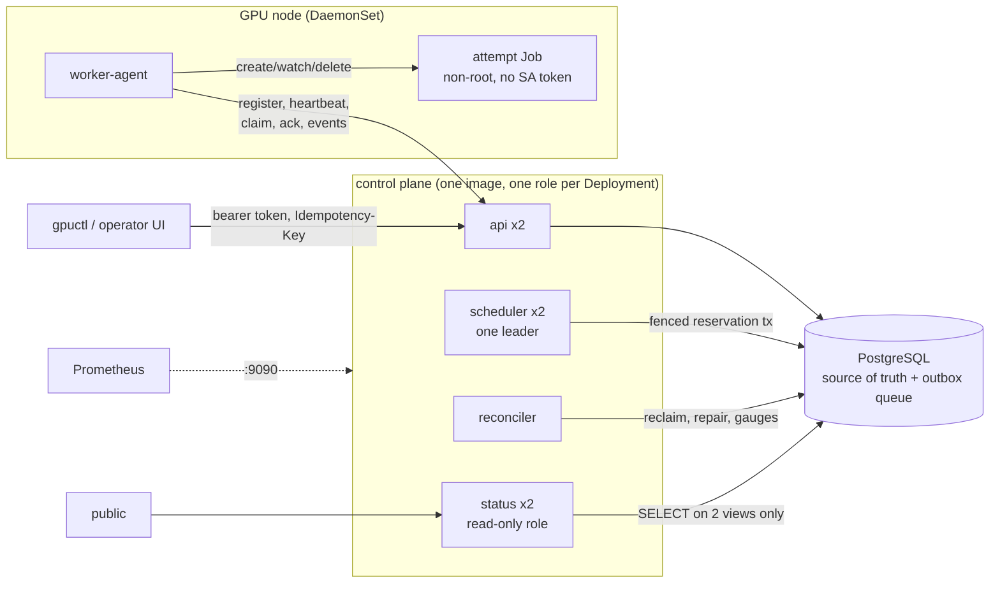

# Control plane design

The multi-pool broker in `controlplane/`. The club broker (`gpu_broker/`) is
described in [DESIGN.md](DESIGN.md); why there are two is
[ADR 0001](decisions/0001-go-control-plane-beside-python-broker.md).

- [Processes](#processes)
- [One job, end to end](#one-job-end-to-end)
- [State machine](#state-machine)
- [Concurrency](#concurrency)
- [Scheduling and EcoShift](#scheduling-and-ecoshift)
- [Failure and recovery](#failure-and-recovery)
- [Security and tenancy](#security-and-tenancy)
- [Data retention](#data-retention)
- [Code map](#code-map)

## Processes



| Role | Writes | Holds credentials for |
|---|---|---|
| api | jobs, attempts (ack/events), artifacts, idempotency keys | database owner role, dispatch MAC key |
| scheduler | reservations, holds, decisions, dispatch events | database owner role, dispatch MAC key |
| reconciler | lease reclaims, repairs, retention | database owner role |
| status | nothing | `gpub_status_login` (SELECT on two views) |
| worker-agent | Kubernetes Jobs in `gpub-jobs` | its worker token, dispatch MAC key, a namespaced Role |

## One job, end to end

1. `gpuctl submit` sends `POST /v1/jobs` with an `Idempotency-Key`. The API
   validates the request at the boundary (`SubmitRequest.Validate`), checks
   quota and the global queue cap (refusals write no row), inserts the job
   as SUBMITTED, checks the cheapest eligible pool against the project's
   available budget, and moves it to QUEUED (or FAILED with the shortfall
   named). One transaction.
2. The scheduler leader reads a snapshot (queued jobs up to `MaxQueueScan`,
   workers, pools, running jobs, decayed usage, budgets, carbon), calls the
   pure `policy.Decide`, and applies each decision in its own transaction.
   A PLACE takes the project lock, re-reads the price, checks the hold,
   compare-and-swaps worker capacity, creates attempt n+1 and the
   reservation, writes the HOLD, moves the job to RESERVED, and enqueues
   `dispatch.<worker>`, all checked against the leader epoch.
3. The agent on that worker claims the event (visibility timeout 30 s), the
   API moves the job to DISPATCHED, creates a 45 s lease, and returns the
   dispatch with an HMAC over attempt, worker, expiry and spec digest.
4. The agent verifies the MAC and digest locally, acks (accepted once per
   attempt; the API re-checks capability), and creates a Kubernetes Job.
5. Heartbeats renew the lease and carry stop orders (cancel, preempt,
   timeout). Log lines and the exit event are spooled to disk, then sent with
   sequence numbers; the API deduplicates on `(attempt, seq)`.
6. The exit event closes the attempt once: settle the run against the hold,
   release the rest, release the reservation (and capacity, once), drop the
   lease, and move the job by `domain.JobStateForOutcome`.

## State machine

[ADR 0003](decisions/0003-job-state-machine.md) has the table and the reason
for every edge. Enforced by `domain.Transition` (the only function that
changes `Job.State`), persisted with actor, reason, time and correlation id,
and pinned by a literal-table test plus random-walk invariants.

Attempts are separate rows with a write-once outcome. A trigger refuses any
update to a closed attempt; a partial unique index allows one open attempt
per job.

## Concurrency

| Requirement | Mechanism | Test |
|---|---|---|
| Two schedulers cannot reserve the same capacity | `UPDATE workers SET gpus_reserved = gpus_reserved + n WHERE gpus_reserved + n <= gpus` must touch one row; CHECK constraint as backstop | `TestCapacityCompareAndSwapUnderContention` (16 racers, 3 GPUs, 20 rounds), `TestConcurrentReservationsExactlyOneWins` |
| At most one active reservation per job | partial unique index | constraint |
| A worker cannot ack the same dispatch twice | `acked_at IS NULL` predicate | `TestDoubleAckAndTamperedDispatchAreRefused` |
| Cancel racing dispatch has one outcome | both lock the job row; each acts on the state it reads | `TestCancelRacingDispatchHasOneDeterministicOutcome` (asserts both orderings occur) |
| Scheduler restart resumes from durable state | no in-memory state; every tick starts from a snapshot | Kind leader replacement |
| Stale reservations reclaimed safely | reconciler re-checks under the job lock; release predicate `released_at IS NULL` | `TestStaleReservationIsReclaimed`, `TestDoubleReleaseReturnsCapacityOnce` |
| Split brain | advisory lock + epoch fencing token checked `FOR SHARE` in every reservation | `TestFencedLeaderCannotReserve` |
| Backpressure | per-tenant queued-job quota, global queue cap (503 + Retry-After), bounded snapshot scan, bounded claim batches | `TestQuotaAndQueueBackpressure` |
| Fairness without starvation | bounded aging in the fair-share score plus a protected-head guard | `TestStarvationGuardBoundsTheWaitOfALargeJob` with its negative control |
| Serialization conflicts | `InTx` retries 40001/40P01 with backoff; counted | `TestInTxRetriesSerializationFailures` (injected from the database) |

## Scheduling and EcoShift

[ADR 0005](decisions/0005-scheduling-decisions-and-policies.md) and
[ADR 0006](decisions/0006-ecoshift-providers-and-fallback.md). The policy
layers, in the order the product added them: FIFO; priority with bounded
aging; fair share (the Python formula, parity-tested against the Python
function); deadline-first; best-fit capacity; preemption where allowed;
cost and carbon scoring; delay when the job allows it.

Every decision stores the policy version, the snapshot digest, every
candidate with raw/normalised/weighted components, every rejection with a
reason code, the budget and carbon effect, the carbon source, and any
fallback. `gpuctl policy explain <job>` prints it.

What the evidence says about EcoShift, stated plainly:

- On the current synthetic workloads with observed GB carbon data,
  `lowest-carbon` increases total estimated emissions and cost relative to
  `lowest-cost` (`docs/evidence/simulator.md`). Choosing a placement by its
  instantaneous carbon score does not establish lower emissions across a
  whole workload. There is no validated savings claim.
- The seasonal forecaster does **not** beat persistence on the held-out week
  of observed GB data (`docs/evidence/forecast.md`). The trust gate therefore
  keeps delay decisions off where it would be wrong; ESO's own forecast is
  about four times more accurate and is the obvious provider to integrate.

## Failure and recovery

| Failure | What happens | Evidence |
|---|---|---|
| Scheduler process death | advisory lock released with the connection; standby takes over with epoch+1 | Kind: forced leader deletion; local: 0.31 s handover |
| Worker process death | heartbeats stop; lease expires (45 s); reconciler marks attempt LOST and requeues as a new attempt | `TestWorkerDeathReclaimsLeaseAndRetriesAsNewAttempt` |
| Agent restart | re-adopts attempt Jobs by worker-id label (Kubernetes) or state files (sim); same attempt continues | `TestAgentRestartRecoversTheInterruptedAttempt`, Kind pod restart |
| Pod deletion (API) | stateless; other replica serves; port-forward reconnects | Kind |
| Node drain | agent reports DRAINING (no new placements); evicted attempt pod fails the Job via podFailurePolicy `DisruptionTarget`; agent reports LOST; retried elsewhere | Kind drain |
| Queue redelivery | claim without handling leaves the event invisible for 30 s, then redelivered; handling is idempotent | `TestQueueRedeliveryAfterAbandonedClaim` |
| Database serialization conflict | transaction retried | `TestInTxRetriesSerializationFailures` |
| Object-storage failure | chunk upload answers 503; agent retries at the committed offset | `TestResumableArtifactUpload` |
| Stale carbon provider | explicit fallback, metric, no carbon claim | `TestStaleCarbonFallsBackExplicitlyAndNeverClaimsCarbon`, simulator |
| Spot interruption | modelled in the simulator (LOST, retried on retries left; interruptible pools refused for a last attempt) | `sim` interruptions column, `filter` rule |
| API outage longer than the lease | agent spools events; expired-but-unreclaimed leases are renewable, so no work is lost | `TestSpoolDeliversTheTerminalEventAfterAnOutage` |

## Security and tenancy

[ADR 0007](decisions/0007-worker-agent-isolation-boundary.md),
[ADR 0008](decisions/0008-tenancy-auth-and-public-status.md),
[threat model](THREAT_MODEL.md).

## Data retention

| Data | Kept | Why |
|---|---|---|
| jobs, transitions, attempts, ledger, decisions | indefinitely | audit and billing; the ledger is the money record |
| delivered outbox events | 7 days | redelivery debugging; undelivered events are never pruned |
| idempotency keys | 24 hours | a client retry window, not an archive |
| worker heartbeat history | 24 hours | stale-worker diagnosis; the latest heartbeat is on the worker row |
| artifacts and logs | until deleted by an operator | no automatic expiry yet |
| carbon snapshots | indefinitely | small, and needed to replay decisions |

## Code map

```
controlplane/
  cmd/gpubroker            roles: migrate api scheduler reconciler status worker-agent sim replay forecast-eval admin
  cmd/gpuctl               CLI over the generated client
  internal/domain          state machine, budget ledger, capability, types (stdlib only)
  internal/domain/policy   Decide: ordering, filtering, scoring, delay, preemption, starvation guard
  internal/domain/ecoshift energy model, readings, forecaster and backtest
  internal/application     use cases and ports (Store, Tx, ObjectStore, Clock, Observer)
  internal/adapters        postgres, objectstore (fs), metrics (prometheus), carbon (fixture)
  internal/transport       httpapi, status, client (generated from contracts/openapi)
  internal/agent           worker agent, sim runtime, kubernetes runtime
  internal/sim             deterministic simulator and trace replay
  migrations               embedded SQL
  data/carbon              versioned GB carbon dataset with manifest and checksum
  tests/e2e                Kind end-to-end script
infra/helm/gpu-broker      chart, alerts, dashboards, Kind and GPU profiles
contracts/openapi          the API contract
```
