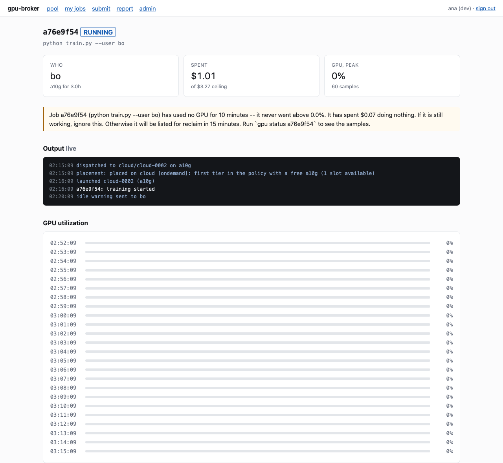

# Running it day to day

What to look at, in roughly the order it matters.

## Every day (30 seconds)

```bash
gpu doctor      # anything broken, and what to do about it
gpu forecast    # exits non-zero past the critical threshold
gpu reap        # exits non-zero if a machine has no live job behind it
```

All three are cron-safe. `gpu forecast` and `gpu reap` exit non-zero on a
finding, so they can gate an alert without parsing output.

## Every week

```bash
gpu digest --send      # the note to the club
gpu reclaim            # jobs holding a GPU without using it
gpu prices --refresh   # AWS moves prices; a stale table is a wrong budget
```

## When somebody asks

**"Why is my job still queued?"**

```bash
gpu queue --why
```

Prints the fair-share term, the age term, and their share of the pool. If they
are behind a lighter user, that is the system working; if they have been waiting
more than `age_max` (12h default) and are still behind, something is wrong.

**"Why did my job cost money when the lab machine was free?"**

```bash
gpu logs <id> | grep placement
```

The placement reasoning is written onto the job at dispatch - which tier was
chosen, and what was skipped to get there.

**"Why was my job refused?"**

```bash
gpu status <id>
```

Refusals are recorded as jobs in the `REFUSED` state with the reason, so "why was
I refused on Tuesday" is answerable on Friday.

**"My job died and I do not know why."**

`gpu status <id>` has the full transition history with a reason on each edge,
plus the utilization samples and any notices sent. The web app shows the same
thing with the output streaming live:



Common causes:

| what you see | what happened |
|---|---|
| `stopped at its $X ceiling` | `--budget` was lower than the job needed |
| `killed for exceeding its host memory limit` | cgroup OOM on the lab machine |
| `the SSM agent never registered` | AMI has no agent, or the instance profile is wrong |
| `spot capacity was reclaimed` | preempted; it should be back in the queue |
| `terminated outside the broker` | somebody used the console |

## When something is wrong

**A lab host is drained.**

```bash
gpu hosts
```

The reason is printed under the table. `limits: NO` is the serious one - jobs
there could take the whole machine down, so nothing is placed until it is fixed.

```bash
gpu admin drain lab1.ucsd.edu --reason "swapping a fan"
gpu admin undrain lab1.ucsd.edu
```

A drained host keeps running whatever is already on it.

**Records disagree with reality.**

```bash
gpu reconcile   # both directions: orphans and machines that vanished
gpu reap        # money-focused: what is alive with no live job, and what it cost
```

Neither terminates anything. `reap` sorts by cost, so the first row is the
conversation worth having today.

**Credits are going faster than expected.**

```bash
gpu forecast          # runway, and the day it runs out
gpu budget --pool     # spent / running / queued / free to dispatch
gpu reclaim           # is somebody holding a card doing nothing
gpu report --days 30  # dollars per *useful* GPU-hour
```

The gap between "dollars per paid hour" and "dollars per useful hour" in the
report is the number that tells you whether the problem is price or waste.

## Adjusting things

```bash
gpu admin add-user newmember --usd 40 --gpu-hours 12
gpu admin users
```

Or from the web app's admin page. Pool-wide caps live in `config.json`
(`pool_budget_usd`, `pool_budget_gpu_hours`) and take effect on the next tick.

## Turning on reclaim

`gpu reclaim` reports and does nothing until you set `reclaim_enabled: true`.
Watch it for a couple of weeks first. Look for:

- jobs it flagged that were actually working (a job that checkpoints for ten
  minutes looks idle)
- whether the owner responded to the warning

Then turn it on. Notifications and the justifying samples are recorded either
way, so a reclaim is always auditable after the fact.

## Backups

`$GPU_BROKER_HOME/broker.sqlite3` is the queue, the ledger, every transition and
every sample. In WAL mode take all three files together, or:

```bash
sqlite3 $GPU_BROKER_HOME/broker.sqlite3 ".backup /backups/gpu-broker-$(date +%F).db"
```

Checkpoints in S3 and data on EFS are separate and have their own lifecycles.
Nothing prunes either automatically - see [NOTES.md](../NOTES.md).

## Metrics

```bash
gpu metrics              # last week, at a glance
gpu metrics --prometheus # the scrape body
gpu metrics --prune      # drop series past the retention window
```

The web app serves `/metrics` in Prometheus format, and it is **off unless
`GPU_BROKER_METRICS_TOKEN` is set**. Those series name people and jobs.
